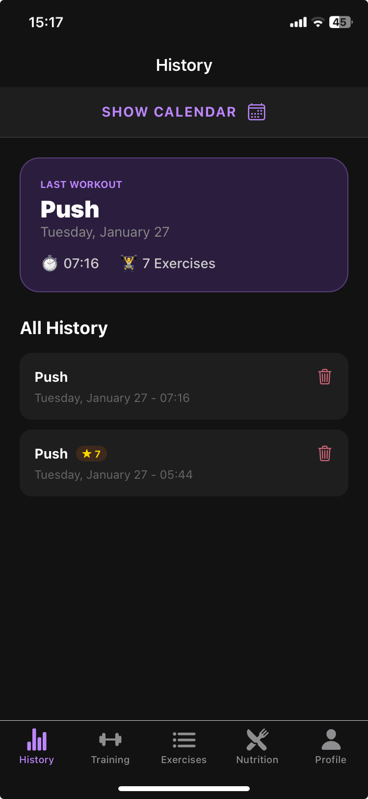
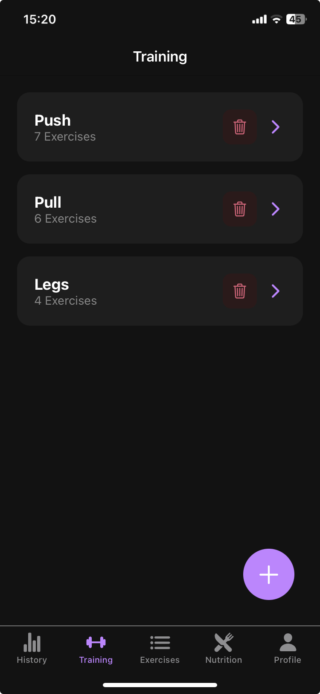
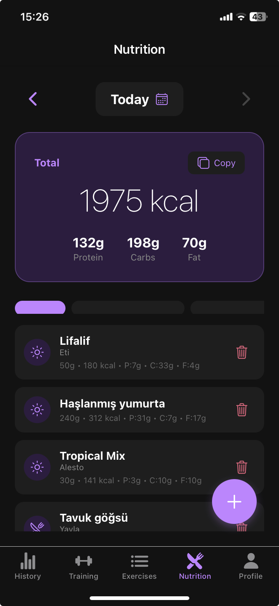
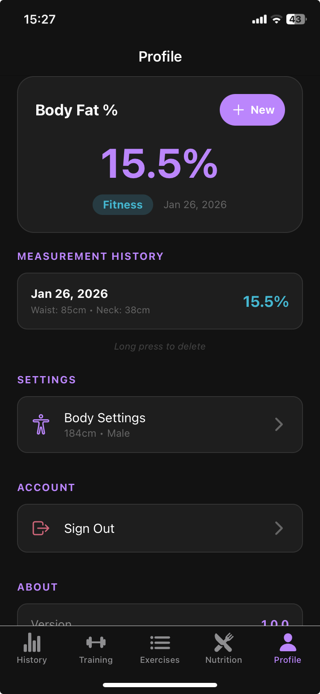

# FullPot 💪

A comprehensive fitness tracking mobile application built with React Native and Expo. Track your workouts, monitor nutrition, and measure body composition progress all in one place.


## 📱 Screenshots


| Home | Workout | Nutrition | Profile |
|:----:|:-------:|:---------:|:-------:|
|  |  |  |  |

## ✨ Features

### 🏋️ Workout Tracking
- **Custom Routines** - Create personalized workout routines (Push Day, Leg Day, etc.)
- **Exercise Library** - Browse a cached exercise catalog with muscle, equipment, and source metadata
- **Live Workout Timer** - Track workout duration in real-time
- **Set Tracking** - Log weight, reps, and mark sets as completed
- **Rest Timer** - Configurable rest timer with push notifications
- **PR Detection** - Automatic Personal Record detection and tracking
- **1RM Calculator** - Estimated one-rep max calculation using Brzycki formula
- **Workout History** - Calendar view of all completed workouts

### 🥗 Nutrition Tracking
- **Food Search** - Search foods via USDA FoodData Central with OpenFoodFacts fallback
- **Macro Tracking** - Track calories, protein, carbs, and fat
- **Meal Categories** - Organize meals by Breakfast, Lunch, Snack, Dinner
- **Daily Goals** - Visual progress bars for macro targets
- **Favorite Foods** - Save frequently eaten foods for quick access
- **Custom Foods** - Add custom meals with manual macro entry
- **Date Navigation** - Browse nutrition history by date

### 📊 Body Measurements
- **Body Fat Calculator** - US Navy method body fat percentage calculation
- **Progress Tracking** - Track measurements over time
- **BFP History** - View body fat percentage trends
- **Gender-specific** - Accurate calculations for both male and female

### 👤 User Management
- **Firebase Authentication** - Secure email/password authentication
- **Guest Mode** - Try the app without creating an account
- **Cloud Sync** - Real-time data synchronization across devices
- **Offline Support** - Local storage for guest users via AsyncStorage
- **Backup Migration** - Export/import versioned JSON backups to preserve Expo Go guest data

## 🛠️ Tech Stack

| Category | Technology |
|----------|------------|
| **Framework** | React Native 0.81.5 |
| **Platform** | Expo SDK 54 |
| **Navigation** | Expo Router 6 (File-based routing) |
| **Backend** | Firebase (Auth + Firestore) |
| **Local Storage** | AsyncStorage |
| **UI Components** | React Native + Ionicons |
| **Calendar** | react-native-calendars |
| **Notifications** | expo-notifications |

## 📁 Project Structure

```
WorkoutTrackerApp/
├── app/                      # Expo Router pages
│   ├── _layout.jsx           # Root layout with providers
│   ├── login.jsx             # Authentication screen
│   └── (tabs)/               # Tab navigation
│       ├── _layout.jsx       # Tab bar configuration
│       ├── index.jsx         # Home - Workout history
│       ├── workout.jsx       # Workout routines list
│       ├── exercises.jsx     # Exercise library
│       ├── nutrition.jsx     # Nutrition tracking
│       ├── profile.jsx       # User profile & measurements
│       └── routine/
│           └── [id].js       # Dynamic workout session
├── components/               # Reusable UI components
│   └── AddMealModal.jsx      # Nutrition modal component
├── context/                  # React Context providers
│   ├── AuthContext.js        # Authentication state
│   ├── WorkoutContext.js     # Workout data management
│   ├── NutritionContext.js   # Nutrition data management
│   └── ProfileContext.js     # Profile & measurements
├── config/
│   └── firebase.js           # Firebase configuration
├── data/
│   └── exercises.json        # Exercise library data
├── styles/                   # Shared stylesheets
│   └── nutritionStyles.js    # Nutrition screen styles
└── assets/                   # Images and icons
```

## 🚀 Getting Started

### Prerequisites

- Node.js 18+ 
- npm or yarn
- Expo Go app (iOS/Android) or emulator
- Firebase project with Auth and Firestore enabled

### Installation

1. **Clone the repository**
   ```bash
   git clone https://github.com/aerkol8/WorkoutTrackerApp.git
   cd WorkoutTrackerApp
   ```

2. **Install dependencies**
   ```bash
   npm install
   ```

3. **Configure environment variables**
   
   Create a `.env` file in the root directory:
   ```env
   EXPO_PUBLIC_FIREBASE_API_KEY=your_api_key
   EXPO_PUBLIC_FIREBASE_AUTH_DOMAIN=your_project.firebaseapp.com
   EXPO_PUBLIC_FIREBASE_PROJECT_ID=your_project_id
   EXPO_PUBLIC_FIREBASE_STORAGE_BUCKET=your_project.appspot.com
   EXPO_PUBLIC_FIREBASE_MESSAGING_SENDER_ID=your_sender_id
   EXPO_PUBLIC_FIREBASE_APP_ID=your_app_id
   ```

4. **Configure optional USDA proxy URL**
   ```env
   EXPO_PUBLIC_USDA_PROXY_URL=https://<your-worker-subdomain>.workers.dev
   ```
   - Any serverless proxy works (Cloudflare Workers, Vercel Functions, Render, Firebase Functions, etc.)
   - If this variable is missing, the app continues with OpenFoodFacts-only mode

   Quick Cloudflare Worker option:
   - Worker template: [`workers/usda-proxy/worker.js`](workers/usda-proxy/worker.js)
   - Deploy steps: [`workers/usda-proxy/README.md`](workers/usda-proxy/README.md)

5. **Start the development server**
   ```bash
   npx expo start
   ```

6. **Run on device/emulator**
   - Scan QR code with Expo Go (iOS/Android)
   - Press `i` for iOS simulator
   - Press `a` for Android emulator

## 🔥 Firebase Setup

1. Create a new Firebase project at [Firebase Console](https://console.firebase.google.com/)

2. Enable **Authentication** with Email/Password provider

3. Create a **Firestore Database** with the following collections:
   - `users` - Workout routines and history
   - `nutrition` - Daily meals and favorites
   - `profiles` - User measurements

4. Set Firestore security rules:
   ```javascript
   rules_version = '2';
   service cloud.firestore {
     match /databases/{database}/documents {
       match /users/{userId} {
         allow read, write: if request.auth != null && request.auth.uid == userId;
       }
       match /nutrition/{userId} {
         allow read, write: if request.auth != null && request.auth.uid == userId;
       }
       match /profiles/{userId} {
         allow read, write: if request.auth != null && request.auth.uid == userId;
       }
     }
   }
   ```

## 📖 Usage

### Creating a Workout
1. Navigate to **Workout** tab
2. Tap **+** to create a new routine
3. Add exercises from the library
4. Start the timer and begin tracking sets

### Tracking Nutrition
1. Navigate to **Nutrition** tab
2. Select a meal type (Breakfast, Lunch, etc.)
3. Search for food or barcode, or add custom meal
4. Track your daily macro progress

### Migration QA

- Manual migration validation checklist:
  [`docs/MIGRATION_QA_CHECKLIST.md`](docs/MIGRATION_QA_CHECKLIST.md)

### Body Measurements
1. Go to **Profile** tab
2. Set your height and gender in Settings
3. Add measurements (waist, neck, hip)
4. View calculated body fat percentage

## 🤝 Contributing

Contributions are welcome! Please feel free to submit a Pull Request.

1. Fork the repository
2. Create your feature branch (`git checkout -b feature/AmazingFeature`)
3. Commit your changes (`git commit -m 'Add some AmazingFeature'`)
4. Push to the branch (`git push origin feature/AmazingFeature`)
5. Open a Pull Request

## 📄 License

This project is licensed under the MIT License - see the [LICENSE](LICENSE) file for details.

## API Integration

- **USDA FoodData Central** - Primary text search via optional proxy URL (Cloudflare Worker template included)
- **OpenFoodFacts API** - Global packaged-food and barcode fallback
- **wger API** - Remote exercise catalog sync
- **Firebase Firestore** - Real-time database for user data
- **Firebase Authentication** - Secure user authentication
- **Expo Notifications** - Push notifications for workout timers

## 🧮 Key Algorithms

- **Epley-style Formula** - 1RM Estimation: `1RM = weight × (1 + reps / 30)`
- **US Navy Body Fat Formula** - Accurate body composition calculation
- **PR Detection** - Automatic tracking of personal records

## 👨‍💻 Author

**Alper Erkol**
- GitHub: [@aerkol8](https://github.com/aerkol8)
- LinkedIn: [Alper Erkol](https://www.linkedin.com/in/alper-erkol-585847313/)

---

<p align="center">
  Made with ❤️ using React Native
</p>
